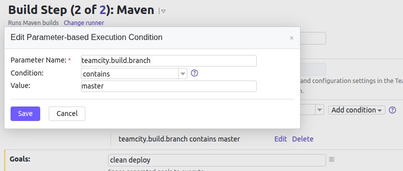
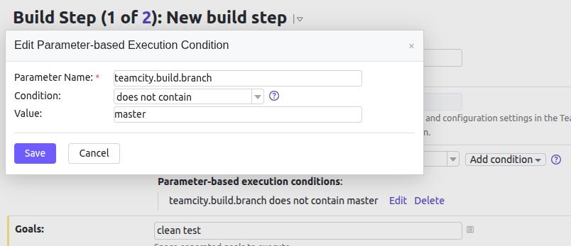

== Teamcity homework ==  
During pre tasks created VMs with dockerized services Teamcity server and Teamcity agent.  
Initialized new teamcity server.  
Authorized new agent in Tamecity server.  
Additionally created VM with Fedora 37 for Nexus and deployed nexus on it.  
Made a fork of given exaple project.  
=== Steps 1-3 ===  
Created homework project.  
Autodetected config as Maven.  
Made first build for master.  
=== Steps 4-7 ===  
Added condition for Build step for master and changed goals to clean deploy.  
  
Created copy of Build step. Changed golas to clean test and added condition to ignore master branch.     
  
