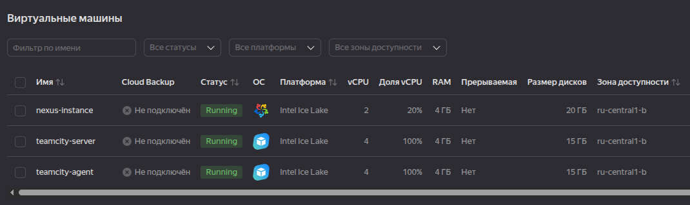
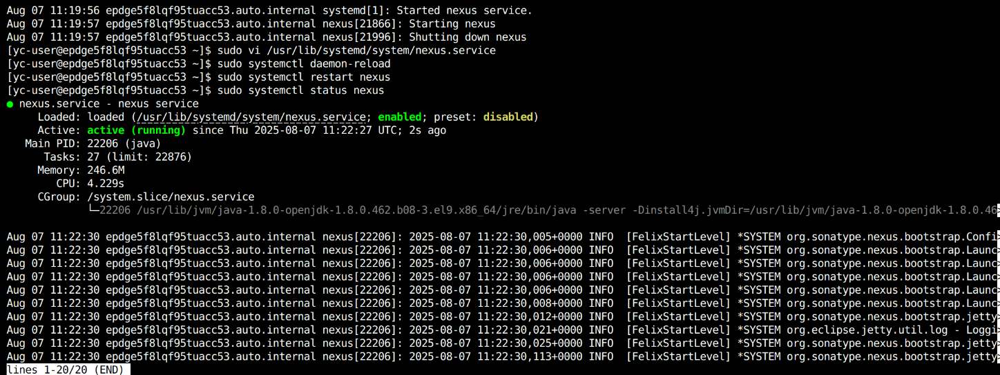
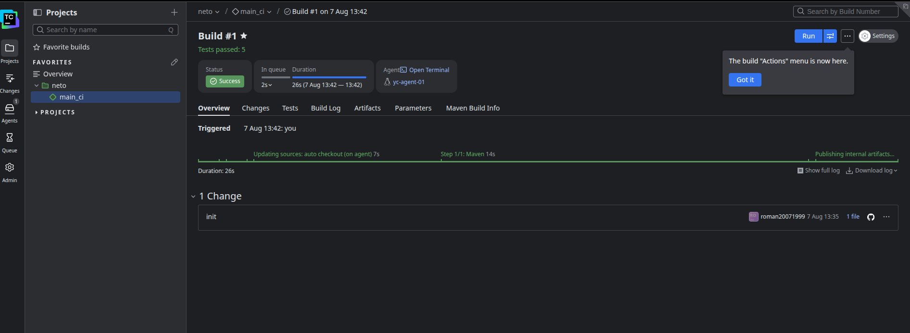
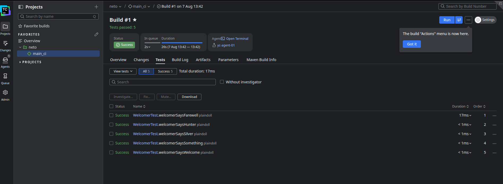
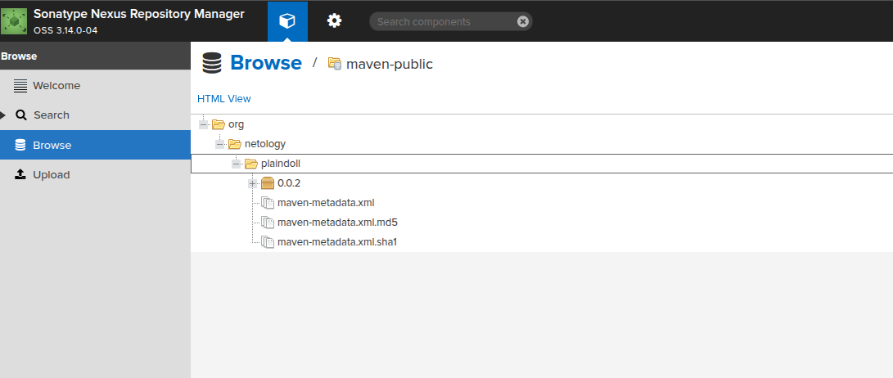
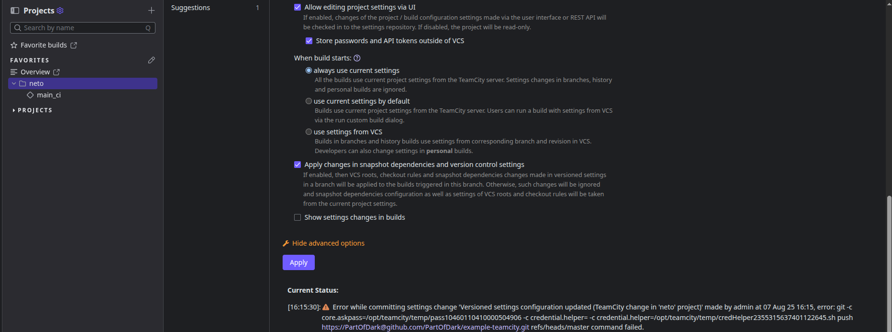
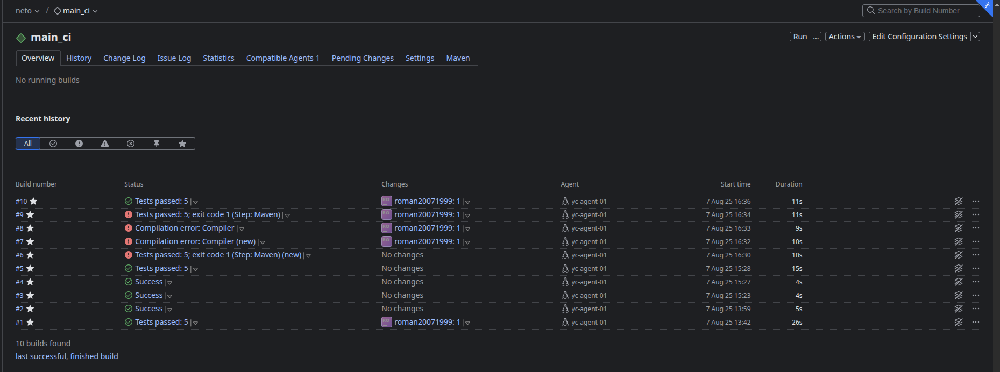
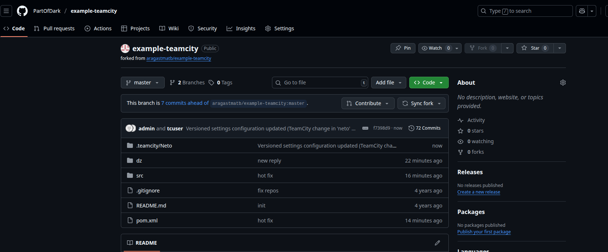

Нужно авторизацию на токен переделать, т.к. видео из лекции устаревшее, то в нем это не уточнено, пока править лень, но проблема понятна.

Поправил проблему с конфигом, загрузил конфигурацию
