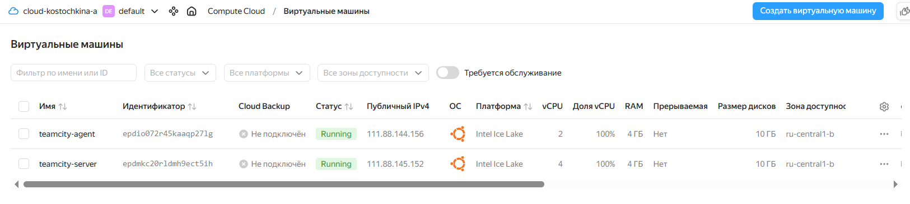
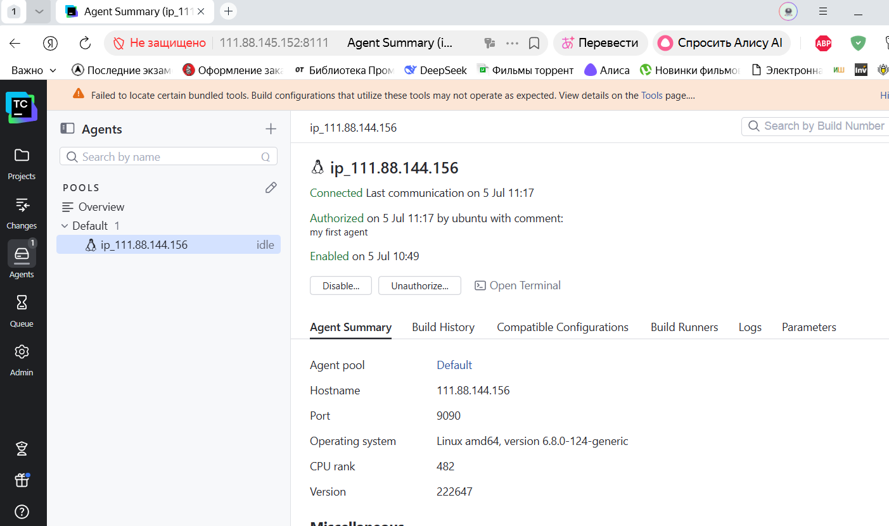
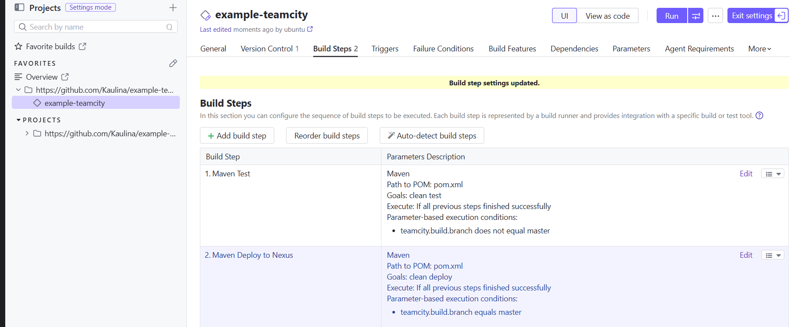
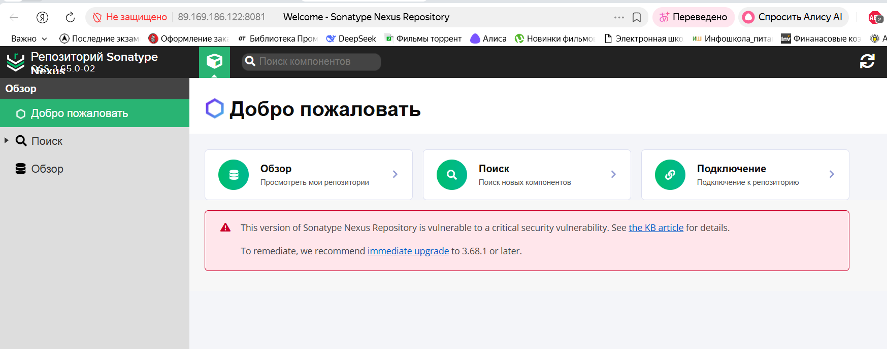
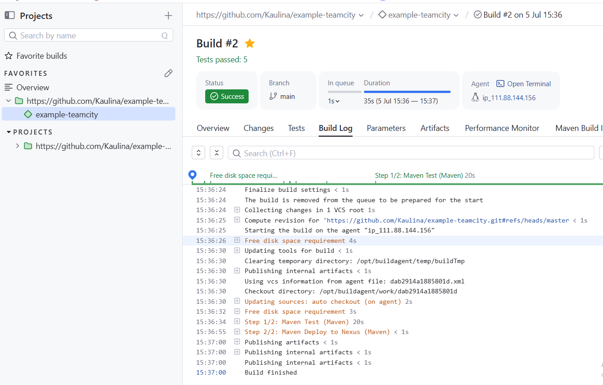
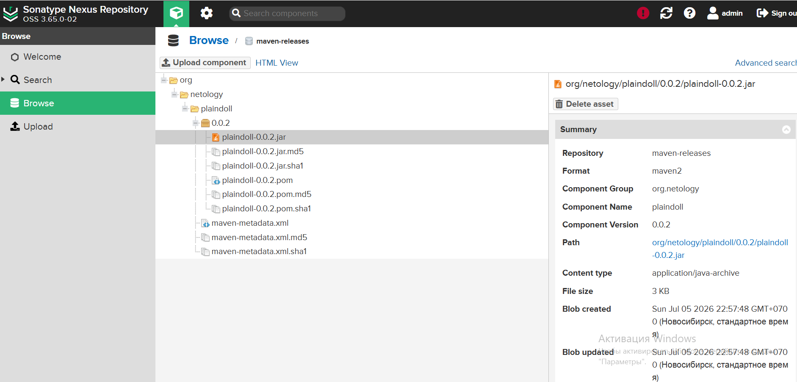

# Домашнее задание к занятию 11 «Teamcity»

предварительно в YC создала teamcity-server и teamcity-agent.

авторизация агента так же пройдена 

далее выполнила настройки в teamcity

Maven Test запустится только тогда, когда ветка не равна master (does not equal master), и выполнит цели clean test.

Maven Deploy to Nexus сработает только в ветке master (equals master).

далее была долгая настройка и борьба с hosts.yml, чтобы настроить nexus, в итоге все получилось

успешная проверка интеграции в teamcity с измененным settings.xml

